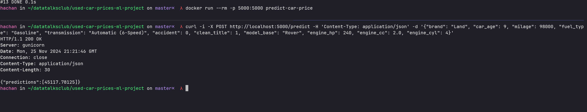

# Used Car Prices Prediction

This project is aimed at building a ML model to predict the price of an used car.
The project includes data preprocessing, exploratory data analysis (EDA), model training, and deployment using Docker.

# Dataset

The dataset used in this project is stored in the `data` directory, which include these files:

- `train.csv` data for training the model
- `test.csv` test data
- `sample_submission.csv` result of the test data

# used_car_prices.ipynb

The project's main analysis and development are documented in the `used_car_prices.ipynb`

# Train.py

`train.py` script is used to train the machine learning model. The trained model is saved in a binary file called `model.bin`

# app.py

Script for serving the model through Flask.

# Set up

First create the venv and install the packages:

```
python -m venv my-venv
source my-venv/bin/activate
pip install --no-cache-dir -r requirements.txt
```

Next run the `train.py`:

```
python train.py
```

Build docker image:

```
docker build -t predict-car-price . --progress=plain
```

Run the image:

```
docker run --rm -p 5000:5000 predict-car-price
```

# Result


